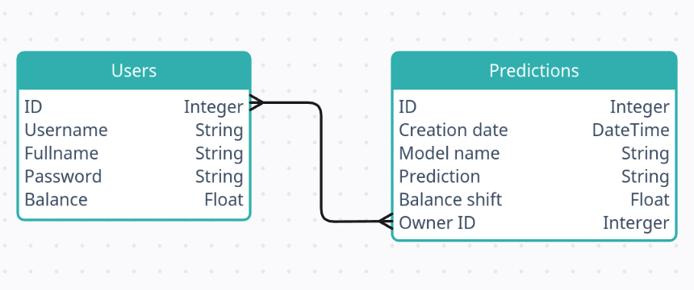

# Задача №3: мониторинг безопасности одиноких пожилых людей

## Описание задачи

Ваша задача - создать модель машинного обучения для мониторинга безопасности одиноких пожилых людей на основе данных от датчиков газа, температуры и инфракрасных датчиков движения. Модель должна способна определять аномалии и необычное поведение, которые могут потребовать вмешательства или помощи.

## Описание датасета

Датасет содержит данные от датчиков газа и температуры, а также инфракрасных датчиков движения, установленных для мониторинга пожилого человека, проживающего один в собственном доме с 2019-11-06 по 2020-02-13. Измерения проводились с временным разрешением в 20 секунд. Датчики воздуха и газа измеряют температуру, влажность, уровень CO2, CO и MOX. Данные от датчиков позиции бинарны: для каждой комнаты 1 означает обнаружение движения в комнате, в то время как 0 означает возврат сенсора к базовому состоянию. Датасет также включает в себя 19 дней измерений (с 2020-01-25 по 2020-02-13), когда никто не находился в помещении (за исключением случайного посещения 2020-01-29 в 15:00) и используется в качестве эталонных данных. Разрешается использовать не весь набор признаков.

## Решение задачи машинного обучения

Будем считать что в доме происходит что-то тревожное, если хотя бы один из датчиков показывает аномальное значения. Аномальными значениями будем считать выбросы, то есть значения которые лежат вне промежутка [0.25 квантиль - 1.5 мкр, 0.75 квантиль + 1.5 мкр], где мкр - межквартильный размах. Так как мы собираемся искать аномалии для случаев, когда в доме кто-то живет, будем брать соответствующую выборку для вычисления границ, с которых начинаются выбросы. Для выборки, когда дом пустовал, будем считать, что аномалий нет.

Таким образом, решаем задачу бинарной классификации (1 - аномалия есть, 0 - аномалии нет).

Рассмотрим 3 модели:

* градиентный бустинг (Sklearn)
* градиентный бустинг (Catboost) 
* случайный лес 

В качестве метрики будем использовать balanced_accuracy_score, так как есть сильный дисбаланс классов (аномалий в разы меньше).

balanced_accuracy_score на тестовой выборке:

* градиентный бустинг (Sklearn): 68.55 %
* градиентный бустинг (Catboost): 61.26 %
* случайный лес: 60.67 %

## Технологический стек платформы

* бекенд: FastApi
* WebUI: Dash
* БД: sqlite
* Асинхронные задачи: Redis, Celery worker

## Схема БД



## Бизнес-логика

Чем выше модель в топе, тем дороже стоит ее предсказание. 

1. градиентный бустинг (Sklearn) - 15 кредитов
2. градиентный бустинг (Catboost) - 7 кредитов
3. случайный лес - 5 кредитов

Выбранная модель будет предсказывать не наличие аномалии, а уверенность в том, что аномалия есть (вероятность), и на основе этой вероятности отправлять соответствующее сообщение:

1. Вероятность < 0.5 -> "OK"
2. 0.5 <= Вероятность < 0.8 -> "WARNING"
3. Вероятность >= 0.8 -> "DANGER"

## Как использовать

1. Устанавливаем зависимости:

```python
pip install -r requirements.txt
```

2. Генерируем секретный ключ для кодировки jwt токенов:

```bash
export SECRET_KEY=$(openssl rand -hex 32)
```

3. Запускаем приложение FastAPI

```python
uvicorn src.main:app 
```

4. Во 2-м терминале запускаем Celery worker

```python
celery -A src.services.predict_service worker -l info
```
5. В 3-м терминале запускаем WebUI

```python
python src/dash/app.py
```

6. Переходи на страницу для [регистрации](http://127.0.0.1:8050/sign-up)


## Пример использования платформы


